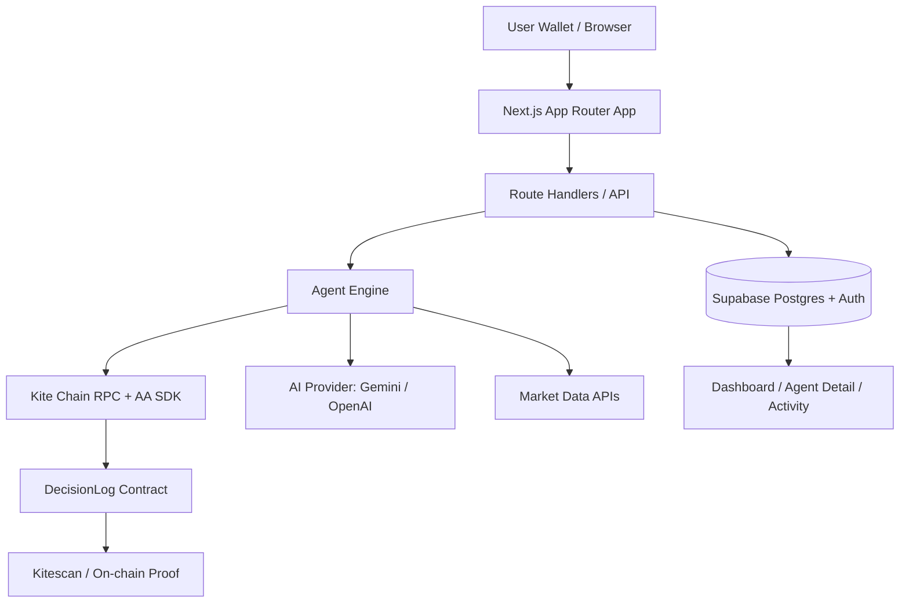
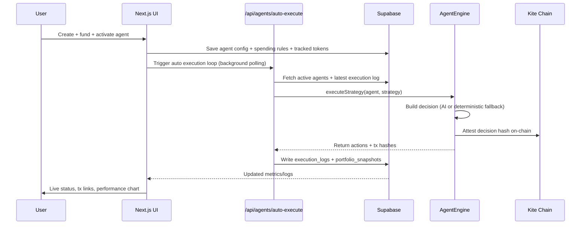

# KiteSwarm

KiteSwarm is an autonomous multi-agent DeFi portfolio manager built for the **Kite AI Global Hackathon 2026** (Agentic Trading & Portfolio Management track).

Users can create AI agents, fund their dedicated vaults, configure strategy and risk controls, activate autonomous execution, and verify each cycle with on-chain attestations on Kite.

## TL;DR Status

- Functional full-stack app: Next.js + Supabase + Kite integrations
- Agent creation, funding, activation, auto-execution, logs, and performance UI are live
- Decision attestations are recorded on-chain
- Swap/bridge/yield actions execute on-chain through AA when adapter env/config is provided
- Fast Demo Mode is available for high-frequency cycles in demo sessions
- No-auth judge demo mode is available (wallet-only flow)
- Cross-chain execution and real protocol adapters are partially scaffolded and marked in roadmap

## Core Value Proposition

1. **Autonomous agent lifecycle**: configure once, then agent runs in background.
2. **Verifiable AI actions**: each cycle is attested on-chain.
3. **User vault model**: each agent has a separate AA-derived vault address.
4. **Demo-ready UX**: one dashboard-centric flow, with fast autonomous cycles and live logs.

## High-Level Architecture



## Implemented vs Planned

### Implemented

- Supabase auth and profile sync
- Agent CRUD + strategy assignment
- Dedicated agent signer identity and AA-derived vault address
- Vault funding (KITE + ERC20)
- Vault withdrawals (KITE + ERC20)
- Editable spending rules
- Tracked tokens and vault holdings valuation
- Auto-execution scheduler
- On-chain decision attestation
- Adapter-based action execution:
  - swap via router (`KITE_SWAP_ROUTER_ADDRESS`)
  - bridge via controller (`KITE_BRIDGE_CONTROLLER_ADDRESS`, `KITE_BRIDGE_ADAPTER_ADDRESS`)
  - yield deposit/withdraw via ERC-4626 vault (`KITE_YIELD_VAULT_ADDRESS`)
- Portfolio snapshots and P/L trend chart
- Activity feed and pagination
- Fast Demo Mode (faster scheduler cadence)
- Wallet-only no-auth demo mode (optional)

### Planned / Partial

- Multi-route DEX quoting (best execution across multiple routers)
- Bridge adapter auto-discovery and dynamic fee quoting
- Protocol-specific Lucid/Aave adapters beyond generic vault/controller interfaces
- Marketplace mechanics (public agents, staking into third-party agents, fee-share)

## Execution Lifecycle



## Agent Vault Model

- Each agent is derived from its own signer identity.
- Vault address is shown in agent detail and can be funded directly.
- Assets inside vault are used by the strategy engine.
- Users can withdraw vault assets back to their wallet using the built-in withdrawal actions.

## Fast Demo Mode

Fast Demo Mode is a UI toggle in the app header.

When enabled:

- Auto-executor polling interval becomes much faster.
- Server scheduler min interval is reduced.
- Strategy interval checks are reduced to demo cadence.

This helps you show repeated autonomous cycles quickly in a hackathon demo.

Important: Fast Demo Mode runs the same backend execution pipeline at higher cadence and **does not fabricate on-chain profit**.

By default, fast autopilot is enabled (`NEXT_PUBLIC_DEFAULT_FAST_AUTOPILOT=true`) so judges immediately see autonomous activity without setup.

## No-Auth Judge Mode

To skip Supabase email login during demos and let judges use wallet-only flow:

```bash
DEMO_NO_AUTH=1
NEXT_PUBLIC_DEMO_NO_AUTH=1
```

Effects:

- Protected dashboard routes become publicly accessible.
- API routes use demo actor context instead of user session auth.
- Wallet connect is still used for funding/withdrawing and on-chain actions.
- Best for hackathon demos; keep auth enabled for production.

## Real Profit Expectations

On testnet, real profit depends on real protocol operations and market conditions.

Current implementation gives you:

- Real vault balances
- Real execution logs
- Real attestation transactions
- Strategy cycle automation

It does **not guarantee yield/profit** without full protocol adapters (swap/LP/yield deposit contracts).

## Decimals and Token Unit Safety

Incorrect decimals can inflate displayed balances massively (e.g., USDT treated as 18 instead of 6).

Protections added:

- Common tokens use locked known decimals
- Custom token transfer/withdraw requires on-chain metadata detection
- UI warning for suspiciously large stablecoin balances

If wrong funding happened:

1. Withdraw token back to wallet.
2. Re-fund with correct token/decimals path.

## Tech Stack

- Next.js (App Router) + TypeScript
- Tailwind + shadcn/ui
- Supabase (Auth + Postgres)
- wagmi + viem + RainbowKit
- ethers v6
- gokite-aa-sdk
- Hardhat (contract deployment)

## Project Structure

```text
src/
  app/
    (dashboard)/
    api/
  components/
    agents/
    auth/
    ui/
    wallet/
  lib/
    agent-engine.ts
    execute-agent-strategy.ts
    kite-aa.ts
    kite-chain.ts
    kite-tokens.ts
    supabase/
  types/
contracts/
scripts/
supabase/
```

## Environment Variables

Create `.env.local` with:

```bash
# Supabase
NEXT_PUBLIC_SUPABASE_URL=
NEXT_PUBLIC_SUPABASE_ANON_KEY=
SUPABASE_SERVICE_ROLE_KEY=

# Wallet / UI
NEXT_PUBLIC_WALLETCONNECT_PROJECT_ID=

# Kite Chain
KITE_RPC_URL=https://rpc-testnet.gokite.ai
KITE_CHAIN_ID=2368
KITE_BUNDLER_URL=https://bundler-service.staging.gokite.ai/rpc/
DECISION_LOG_CONTRACT=
NEXT_PUBLIC_DECISION_LOG_CONTRACT=

# Agent signing
AGENT_MASTER_PRIVATE_KEY=
AGENT_SIGNER_ENCRYPTION_KEY=

# AI provider
AI_PROVIDER=gemini
GEMINI_API_KEY=
GEMINI_MODEL=gemini-2.5-flash
# Optional alternative:
# AI_PROVIDER=openai
# OPENAI_API_KEY=

# Optional tuning
KITE_PRICE_USD=0.01
AGENT_AUTO_MIN_INTERVAL_SECONDS=90
AGENT_AUTO_MAX_AGENTS_PER_TICK=6
NEXT_PUBLIC_AGENT_AUTO_POLL_MS=45000
NEXT_PUBLIC_DEFAULT_FAST_AUTOPILOT=true

# On-chain action adapters
KITE_SWAP_ROUTER_ADDRESS=
KITE_BRIDGE_CONTROLLER_ADDRESS=
KITE_BRIDGE_ADAPTER_ADDRESS=
KITE_YIELD_VAULT_ADDRESS=

# Mainnet bridge defaults discovered from on-chain contract metadata/events:
# KITE_BRIDGE_CONTROLLER_ADDRESS=0x92E2391d0836e10b9e5EAB5d56BfC286Fadec25b
# KITE_BRIDGE_ADAPTER_ADDRESS=0x5eF37628d45C80740fb6dB7eD9c0a753b4f85263

# Judge/demo convenience (wallet-only, no sign-in)
DEMO_NO_AUTH=1
NEXT_PUBLIC_DEMO_NO_AUTH=1
```

## Local Setup

1. Install dependencies:

```bash
npm install
```

2. Run Supabase SQL schema:

- Use `supabase/schema.sql` in Supabase SQL Editor.

3. Run app:

```bash
npm run dev
```

4. Verify quality:

```bash
npm run lint
npm run build
```

## Contract Deployment

Compile:

```bash
npm run contracts:compile
```

Deploy to Kite testnet:

```bash
npm run contracts:deploy:testnet
```

After deployment, set:

- `DECISION_LOG_CONTRACT`
- `NEXT_PUBLIC_DECISION_LOG_CONTRACT`

## API Surface (Selected)

- `GET/POST /api/agents`
- `GET/PUT/DELETE /api/agents/[id]`
- `POST /api/agents/[id]/execute`
- `POST /api/agents/[id]/reset`
- `POST /api/agents/[id]/withdraw`
- `GET /api/agents/[id]/logs`
- `GET /api/agents/[id]/performance`
- `POST /api/agents/auto-execute`
- `GET /api/portfolio`
- `GET /api/activity`

## Judge Demo Flow

1. Open app and connect wallet (no sign-in required in demo mode).
2. Enable **Fast Demo Mode**.
3. Create agent (e.g., Yield Optimizer).
4. Fund vault (KITE + USDT).
5. Activate agent.
6. Show auto-execution logs filling in without manual trigger.
7. Open tx links on Kitescan (attestation proof).
8. Show holdings snapshot and P/L trend.
9. Demonstrate withdraw back to wallet.

## Honest Demo Notes

For judges, use this framing:

- "Autonomous orchestration and attested execution loops are production-oriented and live."
- "Core autonomous loop and attestation are real; some protocol-native adapters (cross-chain, full swap routing, LP/flash-loan legs) remain roadmap components."
- "Fast Demo Mode is for cadence acceleration during demo time; it does not fake on-chain outcomes."

## Troubleshooting

### Build passes but no agent cycles happening

- Agent must be `active`.
- Agent must have strategy and vault funds.
- Check auto-exec interval and latest execution log status.
- Ensure action adapter env vars are set for swap/bridge/yield execution.

### Very large stablecoin valuation

- Usually a decimals mismatch.
- Custom token funding now enforces on-chain decimals detection before transfer.
- Withdraw and re-fund if legacy incorrect-unit funding was already sent.

### Realtime updates not appearing

- Ensure realtime publication includes `execution_logs` and `portfolio_snapshots`.
- Run:
  - `ALTER PUBLICATION supabase_realtime ADD TABLE public.execution_logs;`
  - `ALTER PUBLICATION supabase_realtime ADD TABLE public.portfolio_snapshots;`

### No on-chain tx hash for execution

- Verify `DECISION_LOG_CONTRACT` and signer env variables.
- Check RPC/bundler availability.

## Security Notes

- Use `AGENT_SIGNER_ENCRYPTION_KEY` in non-local environments.
- Never expose private keys in client-side code.
- Restrict service-role key to server route handlers only.

## License

Hackathon project. Add your preferred license before production use.
